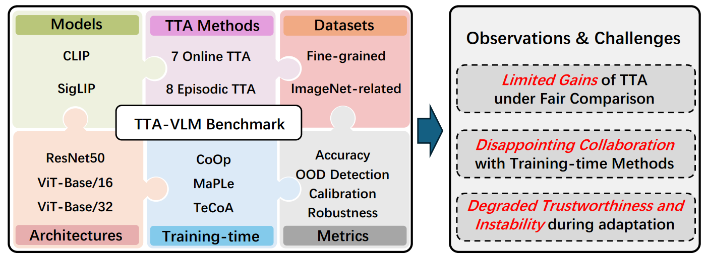

# VLM-TTA: A Benchmark of Test-Time Adaptation for Vision-Language Models

## The Illusion of Progress? A Critical Look at Test-Time Adaptation for Vision-Language Models

### Framework:  


### Prerequisites:

### Dataset:

Please follow [CoOp](https://github.com/KaiyangZhou/CoOp) and manually download the require datasets.

Replace /path/to/dataset with your dataset folder root in below commands and check the path of json file in fewshot_datasets.py.

Replace your_cache_path with your cache folder root in some files (`clip/constants.py`, `instance_tta.py`, `online_tta.py`).

###

1. ##### Episodic Test-Time Adaptation on CLIP

	```python
    python instance_tta.py --data /path/to/dataset --test_sets I -a ViT-B/16 -b 64 --gpu $gpu --ctx_init a_photo_of_a -p 50 --output_dir 'episodic_results/ckps/tpt' --algorithm tpt
    ```

    The algorithm can be replaced by a series of episodic methods supported by this benchmark: `clipzs`, `tpt`, `ctpt`, `rlcf`, `mta`, `zero`, `ttl`, `tps`, `rtpt`.

2. ##### Online Test-Time Adaptation on CLIP

    ```python
    python online_tta.py --data /path/to/dataset --test_sets I -a ViT-B/16 -b 1 --gpu $gpu --ctx_init a_photo_of_a -p 50 --output_dir 'online_results/ckps/tda' --algorithm tda
    ```

    The algorithm can be replaced by a series of online methods supported by this benchmark: `clipzs`, `tda`, `dmn_weak`, `dmn`, `onzeta`, `boostadapter`, `dpe`, `ecalp`, `dyanprompt`.


